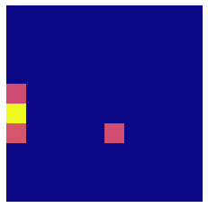

Element_PI.VariancePersist
**************************

.. currentmodule:: Element_PI

.. automethod:: Element_PI.VariancePersist

Example
=======
The following example demonstrates how to create a persistence image based on chemical
data found in the `compound.xyz` file::

    from Element_PI import VariancePersist

    # Size of generated image is 10x10
    pix_y  = 10
    pix_x  = 10

    spread = 2 # Set variance to 2
    specs  = {'maxBD': 2, 'minBD': 0}

    PI_vector = VariancePersist('compound.xyz', 
                                pixelx = pix_x,
                                pixely = pix_y,
                                myspread = spread
                                myspecs = specs,
                                showplot = True)
                                
An example of the image output by running the above code would be:

